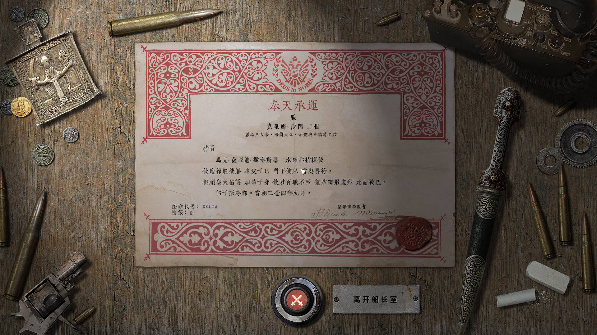

# Highfleet汉化补丁
* [1.使用方法](#使用方法)

* [2.注意事项](#注意事项)

* [3.所用字体](#所用字体)

* [4.Bonus Track](#Bonus-Track) 

* [5.截图](#截图)

  

## 使用方法
1. [下载最新版本的安装程序](https://github.com/Xchiliarch/Highfleet-Chinese-localization/releases/)

   请下载对应游戏版本的汉化。

2. 在安装汉化前备份您的存档及自制舰船。

3. 运行安装程序，安装位置选择Highfleet根目录。例如
   F:\SteamLibrary\steamapps\common\HighFleet

   可在steam通过右键点击游戏，在管理中点击浏览本地文件

   

4. 确保您运行游戏的语言选择为英文。

5. 完成！

## 注意事项
1. **请确认你使用的语言为英语！否则汉化无法生效**
3. 如有任何翻译方面的错漏与名词的统一，欢迎提交Issue。

## Bonus Track！
1.1.2汉化版本及之后添加了一个延长的瞄准线补丁，效果如下

如要使用，请在备份后下载Bonus Track文件夹内的res文件并替换HighFleet\Media\Tex文件夹内同名文件（建议先备份原文件）

## 截图

- There may be some of the things that are translated but not shown.
- 部分汉化内容未展示于截图中。

## Star History

