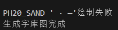
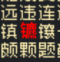
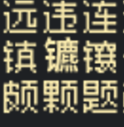
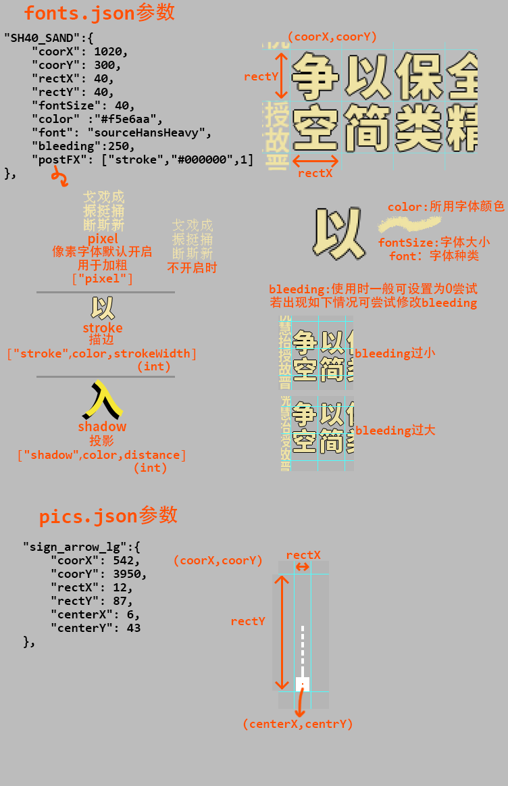

## 依赖

python>=3.8

pillow ([PIL Fork](https://pillow.readthedocs.io/en/stable/installation.html)) ，[fontTools](https://fonttools.readthedocs.io/en/latest/)


## 使用方法

按照下述流程将字体改名并放于fonts文件夹内，运行即可。

默认运行：

```
python main.py
```

若发现输出中提示某些字符无法被指定字体绘制时，



可执行带命令的运行。

```
python main.py --debug
```

以--debug 或 -d 执行，其中所有的无法被绘制的字符都将以红色方块标识（若字体支持），以便于查看字符位置及修改。字符位置按从上至下从左至右排序输出。


```
python main.py --fallback
```

以--fallback 或 -f 执行，所有的无法被绘制的字符都将以红色默认字体（若字体支持），以便于查看字符位置及修改。字符位置按从上至下从左至右排序输出。

⚠️**该选项Fallback 的字体可能并不会匹配于原网格上，请尽量手动绘制。**



```
python main.py --forceFallback
```

以--forceFallback 或 -ff 执行，所有的无法被绘制的字符都将以默认字体（若字体支持）绘制，字符位置按从上至下从左至右排序输出。

⚠️**该选项Fallback 的字体可能并不会匹配于原网格上，请尽量手动绘制。**



上述三种参数互斥，只能选择其一运行。


## 各文件含义

```
src
├───chinese.txt  					汉化文本，由于本人并非文本翻译全权所有者，故不提供文本。如有需要请进群了解
├───main.py      					汉化脚本
├───README.md
│
├───pics							图片文件夹，额外贴图存放位置
│    └──┬───pics.json				额外贴图参数
│      	├───Chinese_logo.png		下为额外贴图
│       ├───credits_Xchiliarch.png	
│       ├───sign_arrow.png			
│       ├───sign_arrow_ap.png
│       ├───sign_arrow_ap_low.png
│       ├───sign_arrow_lg.png
│       └───sign_arrow_lg_low.png 	 					
├───build 							生成文件
|
└───fonts 							字体文件夹，所需字体存储位置,请自行向其中添加所需字体。如需要构建原版汉化，请放入下述字体
     └──────fonts.json  			字体参数
```

vonwaonBitmap.ttf ---[凤凰点阵体16px](https://timothyqiu.itch.io/vonwaon-bitmap)

huiWenMinCho.ttf---[匯文明朝體](https://zhuanlan.zhihu.com/p/344103391)


[思源黑体](https://github.com/adobe-fonts/source-han-sans/releases/download/2.004R/SourceHanSansCN.zip)

sourceHansHeavy.ttf---思源黑体Heavy

sourceHansBold.ttf---思源黑体Bold

sourceHansRegular.ttf ---思源黑体Regular 

## json参数


